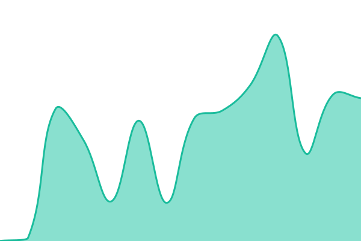
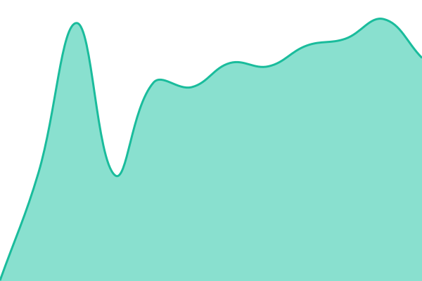

# [📈 Live Status](https://status.meonghideunguniverse.com): <!--live status--> **Semua Sistem Berjalan Optimal**

This repository contains the open-source uptime monitor and status page for [Nara S](https://status.meonghideunguniverse.com), powered by [Upptime](https://github.com/upptime/upptime).

With [Upptime](https://upptime.js.org), you can get your own unlimited and free uptime monitor and status page, powered entirely by a GitHub repository. We use [Issues](https://github.com/workingproasia-nrs/mhu-status/issues) as incident reports, [Actions](https://github.com/workingproasia-nrs/mhu-status/actions) as uptime monitors, and [Pages](https://status.meonghideunguniverse.com) for the status page.

<!--start: status pages-->
<!-- This summary is generated by Upptime (https://github.com/upptime/upptime) -->
<!-- Do not edit this manually, your changes will be overwritten -->
<!-- prettier-ignore -->
| URL | Status | History | Response Time | uptime |
| --- | ------ | ------- | ------------- | ------ |
|  [MHU Website](https://meonghideunguniverse.com) | 🟩 Up | [mhu-website.yml](https://github.com/workingproasia-nrs/mhu-status/commits/HEAD/history/mhu-website.yml) | 

 625ms
     
 | 

<a href="https://status.meonghideunguniverse.com/history/mhu-website">89.33%</a>
    

|  MHU Core API Engine | 🟩 Up | [mhu-core-api-engine.yml](https://github.com/workingproasia-nrs/mhu-status/commits/HEAD/history/mhu-core-api-engine.yml) | 

 551ms
     
 | 

<a href="https://status.meonghideunguniverse.com/history/mhu-core-api-engine">89.86%</a>
    

<!--end: status pages-->

[**Visit our status website →**](https://status.meonghideunguniverse.com)

## 📄 License

- Powered by: [Upptime](https://github.com/upptime/upptime)
- Code: [MIT](./LICENSE) © [Anand Chowdhary](https://anandchowdhary.com), supported by [Pabio](https://pabio.com)
- Data in the `./history` directory: [Open Database License](https://opendatacommons.org/licenses/odbl/1-0/)
